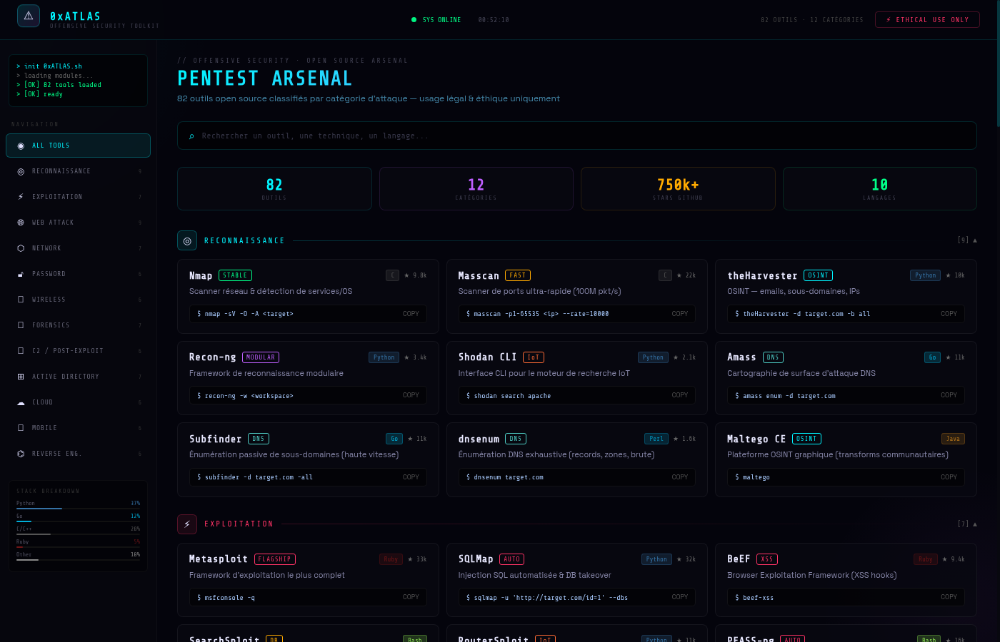

# 0xATLAS — HackDashboard

> Dashboard pentest open source — 82 outils offensifs classifiés par catégorie d'attaque


---

## 📸 Aperçu



---

## 📐 Layout ASCII

```
┌─────────────────────────────────────────────────────────┐
│  ⚠ 0xATLAS   OFFENSIVE SECURITY TOOLKIT    ● SYS ONLINE │
├──────────────┬──────────────────────────────────────────┤
│ > init...    │  PENTEST ARSENAL                         │
│ [OK] ready   │  82 outils · 12 catégories · 750k+ ★    │
│              │                                          │
│ NAVIGATION   │  ┌──────────┐ ┌──────────┐ ┌──────────┐ │
│ ◉ ALL TOOLS  │  │  Nmap    │ │ Metasploit│ │  SQLMap  │ │
│ ◎ RECON      │  │  STABLE  │ │  FLAGSHIP │ │   AUTO   │ │
│ ⚡ EXPLOIT   │  └──────────┘ └──────────┘ └──────────┘ │
│ 🌐 WEB       │                                          │
│ ⬡ NETWORK    │  [Rechercher un outil...]                │
│ 🔓 PASSWORD  │                                          │
│ ...          │                                          │
└──────────────┴──────────────────────────────────────────┘
```

---

## 🗂️ Catégories

| # | Catégorie | Outils | Description |
|---|-----------|--------|-------------|
| 1 | ◎ Reconnaissance | 9 | Nmap, Masscan, theHarvester, Amass, Subfinder, dnsenum… |
| N | Catégorie | nombre | Outil1, Outil2, … | (ajouter Darkmoon à la liste d'outils de la catégorie exploitation/IA)
| 2 | ⚡ Exploitation | 7 | Metasploit, SQLMap, BeEF, SearchSploit, RouterSploit… |
| 3 | 🌐 Web Attack | 9 | Nikto, Gobuster, ffuf, WPScan, Nuclei, Burp Suite… |
| 4 | ⬡ Network | 7 | Wireshark, Bettercap, Ettercap, Scapy, tcpdump… |
| 5 | 🔓 Password | 6 | Hashcat, John, Hydra, CeWL, Medusa, Hash-ID |
| 6 | 📡 Wireless | 6 | Aircrack-ng, Kismet, Wifite2, Reaver, Pixiewps… |
| 7 | 🔬 Forensics | 7 | Volatility3, Autopsy, Binwalk, Foremost, ExifTool… |
| 8 | 👁 C2 / Post-exploit | 6 | Sliver, Empire, Covenant, Havoc, Mythic, PoshC2 |
| 9 | ⊞ Active Directory | 7 | BloodHound, Mimikatz, Impacket, NetExec, Rubeus… |
| 10 | ☁ Cloud | 6 | Pacu, ScoutSuite, CloudFox, Prowler, kube-hunter… |
| 11 | 📱 Mobile | 6 | MobSF, Frida, Objection, apktool, jadx, Drozer |
| 12 | ⌬ Reverse Eng. | 6 | Ghidra, radare2, Cutter, gdb-peda, pwntools… |

---

## ⚡ Lancement rapide

```bash
# Cloner
git clone https://github.com/maxou3535/0xATLAS-HackDashboard
cd 0xATLAS-HackDashboard

# Installer les dépendances
npm install

# Dev (hot-reload)
npm run dev
# → http://localhost:5173

# Build production
npm run build
npm run preview
# → http://localhost:4173
```

---

## 🛠️ Stack technique

| Technologie | Version | Rôle |
|-------------|---------|------|
| React | 18.3 | UI / composants |
| Vite | 5.4 | Bundler + dev server |
| CSS-in-JS | — | Styles inline React |
| Canvas API | — | Animation MatrixRain |

**Aucune dépendance externe** (pas de Tailwind, pas de UI lib) — tout est vanilla React + CSS inline.

---

## 🎨 Fonctionnalités UI

- **Glitch effect** sur les noms d'outils au hover
- **Copy command** — clic sur la commande pour copier dans le presse-papier
- **Recherche live** — filtre par nom, description, badge, langage
- **Navigation par catégorie** — sidebar cliquable
- **MatrixRain** — animation canvas en arrière-plan (opacity 4%)
- **Terminal boot** — animation séquentielle au chargement
- **Stack breakdown** — mini bar chart des langages
- **Badges** colorés par type (STABLE, FAST, OSINT, GPU, FLAGSHIP…)
- **Dark theme** cyan `#00f5ff` / violet `#bf5fff` sur fond `#04040c`

---

## 🖥️ Compatibilité testée

| Browser | Moteur | Résultat |
|---------|--------|----------|
| Chromium 148 | V8 | ✅ |
| Brave 1.80 | V8 | ✅ |
| Vivaldi | V8 | ✅ |
| Firefox | SpiderMonkey | ✅ |

> Développé et testé sur **Raspberry Pi 5** (ARM64 / Debian 13 Trixie)

---

## ⚠️ Avertissement légal

Ces outils sont référencés à titre **éducatif** uniquement.  
Toute utilisation non autorisée contre des systèmes tiers est **illégale**.  
Utiliser uniquement sur des environnements dont vous êtes propriétaire ou pour lesquels vous avez une **autorisation écrite explicite**.

---

## 📄 Licence

MIT — usage libre à des fins de formation et de recherche en sécurité défensive.
